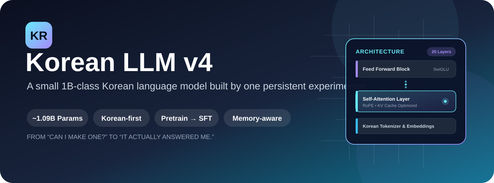
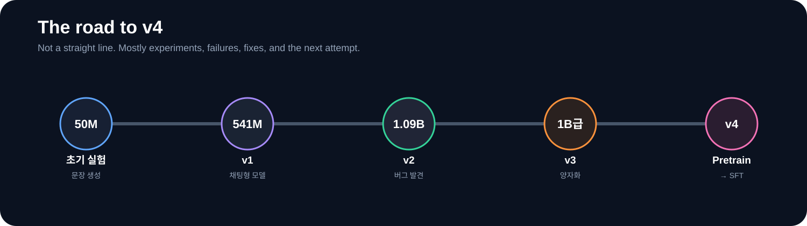
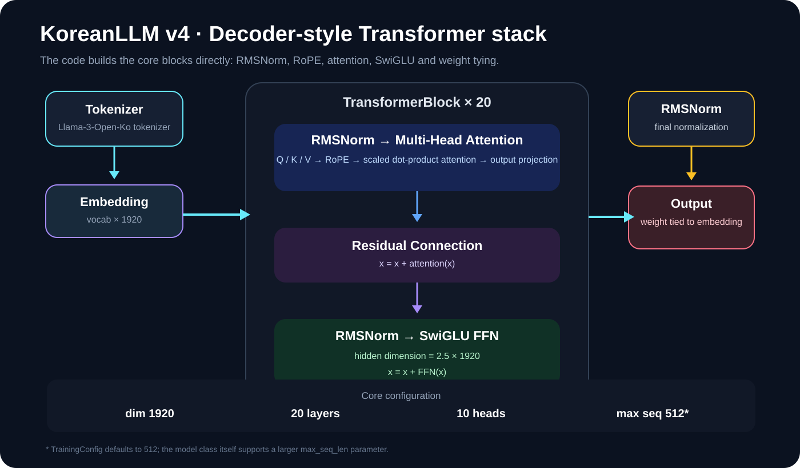
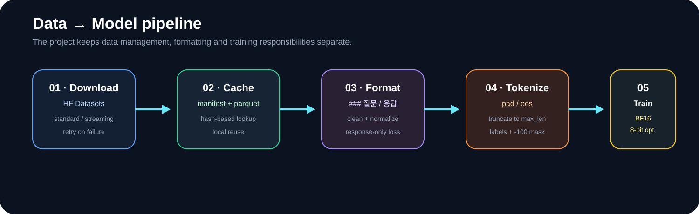
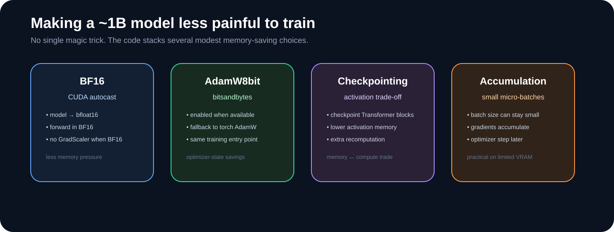
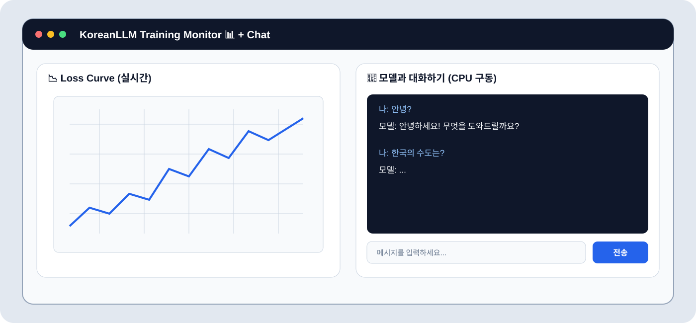
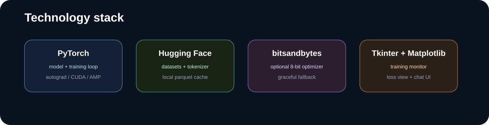

# 🇰🇷 Korean LLM v4

<p align="center">
  
</p>

<p align="center">
  
  
  
  
  
  
</p>

<p align="center">
  
  
  
  
  
  
  
</p>

> **"나도 직접 LLM 하나 만들어보고 싶다."**
>
> 이 프로젝트는 딱 그 생각 하나로 시작했습니다.

---

## 👀 한눈에 보기

| 항목 | 내용 |
|---|---|
| 프로젝트 | **Korean LLM v4** |
| 목적 | 개인 환경에서 직접 만들어보는 한국어 LLM |
| 계열 | Decoder-style Transformer |
| 파라미터 | **약 1.09B** |
| Hidden Dimension | 1,920 |
| Transformer Layers | 20 |
| Attention Heads | 10 |
| FFN | SwiGLU |
| Normalization | RMSNorm |
| Position Encoding | RoPE |
| Tokenizer | `beomi/Llama-3-Open-Ko-8B` |
| 학습 흐름 | **Pretraining → SFT** |
| 기본 학습 길이 | Pretrain 100,000 / SFT 10,000 steps |
| 기본 학습 precision | BF16 |
| 옵티마이저 | AdamW8bit 지원, 미지원 시 AdamW |
| 모니터링 | Tkinter + Matplotlib |
| 체크포인트 | `.pth` |
| 로그 | `training.log` + `loss_history.json` |

> **참고:** 모델 클래스의 기본 `max_seq_len`은 2048이지만, 실제 `TrainingConfig`의 기본 학습 설정은 512입니다.

---

## 🧩 이 프로젝트는 어떻게 시작됐나

처음부터 LLM을 만들 생각이 있었던 건 아닙니다.

그냥 평소에 AI를 쓰다 보니 어느 순간부터 조금 궁금해졌습니다.

**"얘는 대체 어떻게 만들어진 거지?"**

처음에는 AI에게 코드를 받아서 이것저것 만들어보는 정도였습니다. 그런데 계속 코드를 보다 보니까 그냥 가져다 쓰는 것보다 직접 한번 만들어보고 싶어졌습니다.

문제는 제가 아는 게 정말 별로 없었다는 겁니다.

당시에는 `7B`, `13B` 같은 숫자가 모델 크기라는 것 정도만 알고 있었습니다. Transformer가 뭔지도 잘 몰랐고, Attention이나 역전파 같은 건 이름만 들어본 수준이었습니다.

그래도 일단 작은 것부터 만들어봤습니다.

처음에는 제대로 된 모델을 만들 생각보다는 **직접 만들어보면서 배우자**는 쪽에 가까웠습니다. 그런데 막상 공부하려고 하니 또 다른 문제가 있었습니다.

제가 이해할 수 있는 수준에서 시작하면서도, 제가 궁금했던 부분까지 다뤄주는 책을 찾기가 생각보다 어려웠습니다.

그러다가 **『밑바닥부터 시작하는 딥러닝』** 시리즈를 알게 됐습니다.

그리고 제가 만들어서 공개했던 **Korean LLM v3 프로젝트를 개앞맵시 님께서 인상 깊게 봐주셨고, 딥러닝을 제대로 공부해볼 수 있도록 『밑바닥부터 시작하는 딥러닝』 시리즈 전권을 지원해주셨습니다.**

그전까지는 인터넷에서 이것저것 찾아보면서 공부하는 경우가 많았는데, 책을 보면서 직접 코드를 따라 해보고 하나씩 이해할 수 있게 됐습니다.

그래서 요즘은 모델을 무작정 크게 만드는 것보다, **제가 만들고 있는 코드가 왜 이렇게 동작하는지 이해하는 것**에도 신경 쓰고 있습니다.

지금도 책을 계속 보고 있고, 예제도 직접 따라 해보면서 공부하고 있습니다.

아직 모르는 게 훨씬 많지만, 예전처럼 그냥 코드를 받아서 실행하는 것보다는 조금씩이라도 직접 이해하면서 만들어가는 게 목표입니다.

```text
작은 신경망
    ↓
딥러닝 기본 원리
    ↓
Transformer 이해
    ↓
작은 언어 모델
    ↓
541M급 모델
    ↓
1B급 모델
    ↓
Korean LLM v4
```

그래서 이 프로젝트는 단순히 **"LLM 하나를 만들어보자"**에서 끝나는 프로젝트가 아닙니다.

처음에는 아무것도 몰랐던 상태에서 시작해서,

**직접 구현하고 → 이해하고 → 실패하고 → 고치고 → 다시 학습하는 과정**

그 자체를 기록하는 프로젝트이기도 합니다.

아직 배워야 할 것도 많습니다.

그래서 지금도 계속 책을 보고, 코드를 읽고, 직접 실험하고 있습니다.

언젠가는 지금 만들고 있는 모델의 코드 한 줄 한 줄을 보면서 **왜 이렇게 작성했는지 스스로 설명할 수 있는 것**이 또 하나의 목표입니다.

---

# 🧱 처음에는 코드부터 만들기 시작했습니다

처음에는 멋진 아키텍처 설계 문서가 있었던 것도 아닙니다.

AI에게 코드 조각을 받아서 붙이고,

실행하고,

에러를 보고,

다시 고치고,

또 실행했습니다.

특히 초반에는 **Dimension Error가 안 나는 것만으로도 기뻤습니다.**

데이터를 모으고 정리하는 과정도 직접 해봤고, 학습이 잘 되는지 확인하기 위해 컴퓨터 화면을 계속 바라봤습니다.

처음부터 모든 것을 혼자 알고 만든 프로젝트는 아닙니다.

AI의 도움도 받았습니다.

다만 그 과정에서 코드가 실제로 돌아가는지 확인하고, 에러를 고치고, 구조를 바꾸고, 학습 결과를 보고 다음 시도를 결정하는 일은 계속 직접 해야 했습니다.

그래서 이 저장소는 "처음부터 모든 걸 알고 만든 코드"라기보다는 **모르는 상태에서 시작해서 하나씩 이해해간 실험 기록**에 가깝습니다.

---

# 🕰️ v1 이전 → v1 → v2 → v3 → v4

<p align="center">
  
</p>

### 🟦 초기 실험 · 약 50M

첫 모델은 위키피디아 데이터로 학습한 아주 작은 모델이었습니다.

크기는 약 **50M(5천만) 파라미터**.

대화가 가능한 수준은 아니었지만, 어느 정도 문법에 맞는 문장을 만들어내기 시작했습니다.

지금은 이 모델이 남아 있지 않습니다.

그래도 이때 처음으로

> "어? 진짜 문장을 만들긴 하네?"

라는 느낌을 받았습니다.

그 작은 성공 때문에 여기서 멈추기가 어려워졌습니다.

---

### 🟪 v1 · 약 541M

그 다음 목표는 명확했습니다.

**"이번에는 채팅이 되게 만들어보자."**

그래서 모델을 계속 키우고 데이터 형식도 대화 중심으로 바꾸면서 v1을 발전시켰습니다.

결과적으로 약 **541M 파라미터**까지 올라갔습니다.

여전히 부족한 부분은 많았지만, 그냥 문장을 생성하는 모델에서 **질문과 응답을 시도하는 모델**로 방향이 바뀌었습니다.

---

### 🟩 v2 · 약 1.09B

그다음에는 아예 1B급으로 올렸습니다.

약 **1.09B(10억 9천만) 파라미터** 규모까지 모델을 키웠습니다.

방학 동안 시간이 날 때마다 컴퓨터를 켜고 학습을 돌렸습니다.

긴 학습 끝에 어느 순간 **44,000 step**에 도달했습니다.

그리고 테스트를 위해 채팅창에:

```text
안녕?
```

이라고 입력했습니다.

모델이:

```text
안녕하세요! 오늘은 무엇을 도와드릴까요?
```

라고 답했습니다.

그 순간은 정말 컸습니다.

"내가 만든 모델이 진짜 대답했다"는 느낌이었습니다.

---

### 🟥 그런데 바로 다음 질문에서 문제가 생겼습니다

다른 질문을 던져보니 전혀 엉뚱한 대답이 나오기 시작했습니다.

모델이 사용자의 지시를 제대로 따르지 않는 문제가 있었습니다.

그동안 학습한 결과를 보고 있자니 굉장히 아까웠지만, 원인을 고치려면 결과물을 과감하게 버리고 다시 시작하는 편이 낫다고 판단했습니다.

이 과정에서 배운 건 꽤 단순했습니다.

> **파라미터가 커진다고 원하는 모델이 자동으로 만들어지는 것은 아닙니다.**

데이터 형식, 학습 목적, 생성 방식, loss 처리 같은 것들이 전부 같이 맞아야 했습니다.

---

### 🟧 v3 · 모델을 덜 무겁게

1B급 모델은 생각보다 무거웠습니다.

VRAM 사용량이 커지면서 일반적인 환경에서 돌리기가 부담스러웠습니다.

그래서 v3에서는 **양자화와 경량화**에 관심을 두었습니다.

목표는 간단했습니다.

> "성능을 가능한 한 유지하면서 더 쉽게 돌릴 수 있게 만들자."

학습 자체를 계속 확장하기보다는, 이미 만든 모델을 실제로 사용할 때 생기는 문제에 집중했습니다.

---

### 🩷 v4 · 데이터와 학습 파이프라인을 다시 설계

v4에서는 생각을 조금 바꿨습니다.

**작은 데이터셋으로 1B 모델을 억지로 학습시키는 것보다, 먼저 충분한 텍스트를 학습시키고 그 다음에 대화 방법을 가르치는 게 낫지 않을까?**

그래서 학습 과정을:

```text
┌───────────────────┐
│ Korean Text Corpus│
└─────────┬─────────┘
          ↓
┌───────────────────┐
│   Pretraining     │
│ "언어 자체를 학습" │
└─────────┬─────────┘
          ↓
┌───────────────────┐
│       SFT         │
│ "질문에 답하는 법" │
└─────────┬─────────┘
          ↓
┌───────────────────┐
│   Korean LLM v4   │
└───────────────────┘
```

형태로 구성했습니다.

---

# 🧠 v4 모델 구조

<p align="center">
  
</p>

모델의 핵심 Transformer 구성은 코드 안에서 직접 구현되어 있습니다.

```python
class RMSNorm(nn.Module):
    ...

class SwiGLU(nn.Module):
    ...

class Attention(nn.Module):
    ...

class TransformerBlock(nn.Module):
    ...

class KoreanLLM(nn.Module):
    ...
```

즉, 단순히 외부 LLM 클래스를 가져와 이름만 바꾼 구조가 아닙니다.

Embedding부터 Attention, FFN, normalization, output layer까지 모델의 핵심 부분을 직접 연결해 하나의 모델로 구성했습니다.

---

## 📐 핵심 하이퍼파라미터

| 항목 | 값 |
|---|---:|
| `dim` | **1920** |
| `n_layers` | **20** |
| `n_heads` | **10** |
| Head Dimension | **192** |
| FFN Hidden | **4800** (`1920 × 2.5`) |
| Vocab Size | tokenizer 크기에 따라 결정 |
| Max Sequence Length | 학습 기본값 **512** |
| Output Layer | Embedding weight tying |
| Position | Rotary Position Embedding |
| Norm | RMSNorm |
| Activation | SwiGLU |

---

# 🔍 내부에서 실제로 하는 일

### 1. Embedding

토큰 ID를 1920차원 벡터로 변환합니다.

```text
token id
   ↓
Embedding
   ↓
1920-dimensional representation
```

---

### 2. Attention

각 Transformer block에서 Q, K, V를 만들고 Attention을 계산합니다.

코드에서는:

```python
self.wq = nn.Linear(dim, dim, bias=False)
self.wk = nn.Linear(dim, dim, bias=False)
self.wv = nn.Linear(dim, dim, bias=False)
self.wo = nn.Linear(dim, dim, bias=False)
```

형태로 구성합니다.

그리고 PyTorch의 scaled dot-product attention을 사용합니다.

```python
F.scaled_dot_product_attention(...)
```

---

### 3. RoPE

Q와 K에는 Rotary Position Embedding을 적용합니다.

```text
Q ──┐
    ├── RoPE ── Attention
K ──┘
```

이렇게 토큰의 위치 정보를 Attention 계산에 반영합니다.

---

### 4. SwiGLU

Attention 뒤에는 SwiGLU 기반 Feed Forward Network가 들어갑니다.

```python
return self.w2(
    F.silu(self.w1(x)) * self.w3(x)
)
```

즉, 단순한 `Linear → Activation → Linear`보다 조금 더 구조화된 FFN을 사용합니다.

---

### 5. Residual Connection

각 block에서는 Attention과 FFN 뒤에 residual connection을 사용합니다.

```python
x = x + h
x = x + self.feed_forward(...)
```

Transformer block을 쌓을 때 중요한 기본 골격입니다.

---

### 6. Weight Tying

Embedding과 output projection의 weight를 공유합니다.

```python
self.output.weight = self.embed.weight
```

따라서 같은 파라미터를 두 군데에서 따로 저장하는 대신 하나를 공유합니다.

---

# 📚 데이터 파이프라인

<p align="center">
  
</p>

데이터 처리도 이번 버전에서 꽤 많은 부분을 손봤습니다.

단순히 다운로드하고 바로 학습시키지 않고, 캐시와 manifest를 사용합니다.

```text
Hugging Face
      ↓
DatasetManager
      ↓
download / streaming
      ↓
local cache
      ↓
Parquet
      ↓
LocalKoreanDataset
      ↓
tokenization
      ↓
train / validation
```

---

## 🗃️ 데이터셋 관리

코드에는 `DatasetManager`라는 별도 클래스가 있습니다.

이 클래스는:

| 기능 | 설명 |
|---|---|
| 다운로드 | Hugging Face dataset 다운로드 |
| 캐시 | 이미 받은 데이터 재사용 |
| Manifest | 어떤 설정으로 받은 데이터인지 기록 |
| Hash | dataset config 기반 식별 |
| Streaming | 큰 데이터셋에서 선택적 사용 |
| Retry | 다운로드 실패 시 다른 전략 시도 |
| Parquet | 로컬 데이터 저장 |

까지 담당합니다.

특히 다운로드가 실패했을 때 한 번 실패하고 그냥 종료하는 대신:

```text
standard
   ↓
streaming
   ↓
force_redownload
```

순서로 여러 방법을 시도하도록 구성되어 있습니다.

---

# 🧾 SFT 데이터 형식

SFT에서는 데이터를 다음처럼 정리할 수 있습니다.

```text
### 질문: 한국의 수도는 어디인가?
### 응답: 대한민국의 수도는 서울입니다.
```

입력에 추가 정보가 있다면:

```text
### 질문: 다음 문장을 영어로 번역하세요.
### 입력: 안녕하세요.
### 응답: Hello.
```

형태가 됩니다.

코드에서는 여러 데이터셋 형식을 확인하고 가능한 경우 하나의 공통 형식으로 바꿉니다.

지원하는 형태의 예:

```text
text
content
document
body

instruction + input + output

question + response
question + answer

prompt + response
```

이런 식으로 들어오는 데이터셋들을 하나의 학습 형식으로 모읍니다.

---

# 🎯 Response-only Loss

v4에서 특히 중요한 부분입니다.

SFT에서는 질문 부분보다 **응답 부분을 직접 학습하는 것**에 집중하도록 만들었습니다.

예:

```text
### 질문: 한국의 수도는?
### 응답: 서울입니다.
```

이 데이터가 있을 때:

```text
질문 부분  → loss = -100
응답 부분  → 실제 loss 계산
```

형태가 됩니다.

코드에서는:

```python
labels = [-100] * prompt_budget + response_ids[:response_budget] + [eos_id]
```

로 만들고,

```python
F.cross_entropy(
    ...,
    ignore_index=-100
)
```

으로 `-100`을 무시합니다.

이렇게 하면 프롬프트 자체를 그대로 외우는 것보다 **응답을 생성하는 방향의 학습**에 집중할 수 있습니다.

---

# 🧮 Tokenizer 처리

현재 코드는 다음 tokenizer를 불러옵니다.

```python
AutoTokenizer.from_pretrained(
    "beomi/Llama-3-Open-Ko-8B"
)
```

그리고 pad token이 없거나 EOS와 같은 경우 별도의 pad token을 추가합니다.

```text
<|pad|>
```

즉:

```text
EOS ≠ PAD
```

가 되도록 처리합니다.

이 부분은 padding과 label masking을 제대로 관리하기 위해 필요합니다.

---

# 💾 메모리를 줄이기 위한 여러 선택

<p align="center">
  
</p>

1B급을 개인 환경에서 학습하려고 하면 "모델 하나 만들었다!"에서 끝나는 게 아닙니다.

**그 모델을 실제로 학습시킬 수 있느냐**가 또 다른 문제입니다.

그래서 한 가지 기법에만 의존하지 않고 여러 방법을 조합했습니다.

---

## 🟦 BF16

CUDA 환경에서 기본적으로 BF16을 사용할 수 있습니다.

```python
with torch.amp.autocast("cuda", dtype=torch.bfloat16):
    _, loss, _ = model(input_ids, labels=labels)
```

모델도 CUDA 환경에서는:

```python
model = model.to(torch.bfloat16)
```

로 변환합니다.

---

## 🟩 8-bit Optimizer

`bitsandbytes`가 존재한다면:

```python
bnb.optim.AdamW8bit(...)
```

을 사용합니다.

그렇지 않으면:

```python
torch.optim.AdamW(...)
```

으로 자동 fallback합니다.

즉, bitsandbytes가 반드시 있어야 전체 코드가 실행되는 구조는 아닙니다.

---

## 🟪 Gradient Checkpointing

학습 중 Transformer layer를 PyTorch checkpoint로 감쌉니다.

```python
x, kv = checkpoint(
    layer,
    x,
    f_cos,
    f_sin,
    None,
    use_reentrant=False
)
```

메모리를 절약하는 대신 일부 계산을 다시 수행하는 방식입니다.

---

## 🟧 Gradient Accumulation

기본 학습 설정은 작은 batch를 여러 번 누적합니다.

| 설정 | 기본값 |
|---|---:|
| Batch Size | 2 |
| Gradient Accumulation | 8 |
| Learning Rate | `5e-5` |
| Warmup | 200 |
| Weight Decay | 0.1 |

즉, 한 번에 큰 batch를 넣기 어려운 환경에서 **작은 batch를 여러 번 처리하고 optimizer를 나중에 업데이트**하도록 구성했습니다.

---

# 🔄 전체 학습 흐름

```text
                    ┌──────────────────┐
                    │      START       │
                    └────────┬─────────┘
                             ↓
                    ┌──────────────────┐
                    │ Load tokenizer   │
                    └────────┬─────────┘
                             ↓
                    ┌──────────────────┐
                    │ Download / cache │
                    │ datasets         │
                    └────────┬─────────┘
                             ↓
                    ┌──────────────────┐
                    │ Train / Val split│
                    └────────┬─────────┘
                             ↓
                    ┌──────────────────┐
                    │ Create model     │
                    │ ~1.09B params    │
                    └────────┬─────────┘
                             ↓
              ┌──────────────┴──────────────┐
              │                             │
              ↓                             ↓
      ┌──────────────┐             ┌──────────────┐
      │ Pretraining  │             │ Manual SFT   │
      └──────┬───────┘             └──────────────┘
             ↓
      ┌──────────────┐
      │ checkpoint   │
      └──────┬───────┘
             ↓
      ┌──────────────┐
      │ SFT resume   │
      └──────┬───────┘
             ↓
      ┌──────────────┐
      │ sample test  │
      └──────┬───────┘
             ↓
      ┌──────────────┐
      │ final model  │
      └──────────────┘
```

`--stage auto`를 사용하면 위 흐름 중 **Pretraining → checkpoint → SFT**가 자동으로 이어집니다.

---

# 🧪 Evaluation도 넣었습니다

학습이 진행되는 동안 validation split을 만들고, 일정 step마다 validation loss를 계산합니다.

기본 설정:

```text
validation split = 2%
validation batches = 32
```

그리고 일정한 평가 구간마다 간단한 샘플도 생성합니다.

현재 코드의 기본 테스트 prompt는:

```text
한국의 수도는
인공지능이란
안녕?
```

입니다.

즉, 숫자 하나만 보는 게 아니라 실제 생성 결과가 어떻게 바뀌는지도 같이 확인할 수 있게 되어 있습니다.

---

# 💬 생성 방식

생성 함수에는 몇 가지 sampling 옵션이 들어 있습니다.

| 옵션 | 기본값 |
|---|---:|
| Temperature | `0.6` |
| Top-K | `40` |
| Top-P | `0.95` |
| Repetition Penalty | `1.3` |
| Max Tokens | `512` |

프롬프트는:

```text
### 질문: {prompt}
### 응답:
```

형태로 넣습니다.

그 뒤 모델이 다음 토큰을 한 개씩 생성합니다.

---

# ⚡ KV Cache

생성할 때 매번 전체 문장을 다시 계산하지 않고 이전 Key/Value를 저장해 재사용합니다.

```text
첫 토큰
 ↓
K / V 저장
 ↓
다음 토큰
 ↓
기존 K / V + 새 K / V
 ↓
다음 토큰 ...
```

코드에서는:

```python
kv_caches = None
```

으로 시작하고 이후 각 Transformer layer에서 cache를 이어갑니다.

그래서 학습용 forward와 생성용 forward가 조금 다른 구조를 가집니다.

---

# 🖥️ 학습 모니터 GUI

<p align="center">
  
</p>

이 부분도 그냥 로그만 보는 대신 간단한 GUI를 넣어봤습니다.

`Tkinter` 창 안에서:

### 📉 Loss

학습 중 저장되는:

```text
step
loss
validation_loss
learning_rate
time
```

정보를 기반으로 loss curve를 보여줍니다.

### 💬 Chat

체크포인트를 CPU로 불러와 간단하게 대화할 수 있습니다.

```text
[최신 체크포인트 로드]
         ↓
     CPU load
         ↓
      "안녕?"
         ↓
      generate()
         ↓
       response
```

즉, 학습 프로그램과 테스트 프로그램을 따로 만들지 않고 **하나의 모니터 프로그램 안에서 이어서 확인할 수 있는 구조**입니다.

---

# 📦 Checkpoint 시스템

학습 결과는 단순히 모델 weight만 저장하지 않습니다.

```python
checkpoint = {
    "step": step,
    "model_state_dict": model.state_dict(),
    "optimizer_state_dict": optimizer.state_dict(),
    "scheduler_state_dict": scheduler.state_dict(),
}
```

형태로 저장합니다.

그래서 다음 학습 때:

```text
model
 +
optimizer
 +
scheduler
 +
step
```

을 함께 복원할 수 있습니다.

---

## 🗂️ 생성되는 파일

```text
.
├── korean_llm_advanced_v4.py
│
├── datasets/
│   ├── cache/
│   └── datasets_manifest.json
│
├── checkpoints/
│   ├── pretrain/
│   │   └── korean_llm_XXXXX.pth
│   └── sft/
│       └── korean_llm_XXXXX.pth
│
└── logs/
    ├── training.log
    └── loss_history.json
```

---

# 📝 로그

학습 로그는 별도의 파일로 계속 저장합니다.

```text
logs/training.log
logs/loss_history.json
```

Loss 기록은 JSON 형태로 저장되기 때문에 학습을 껐다가 다시 켜도 기존 기록을 불러올 수 있습니다.

```python
load_loss_history()
```

를 통해 이전 기록을 읽고,

```python
save_loss_history()
```

를 통해 다시 저장합니다.

---

# 🎛️ 학습 설정

현재 코드에서는 `dataclass`로 학습 설정을 관리합니다.

주요 기본값은 다음과 같습니다.

| 설정 | 기본값 |
|---|---:|
| Stage | `auto` |
| Batch Size | `2` |
| Accumulation Steps | `32` |
| Max Steps | `50,000` |
| Pretrain Steps | `100,000` |
| SFT Steps | `10,000` |
| Learning Rate | `5e-5` |
| Warmup Steps | `200` |
| Max Sequence Length | `512` |
| Validation Split | `0.02` |
| Validation Batches | `32` |
| Workers | `4` |
| BF16 | `True` |
| 8-bit Optimizer | `True` |
| Weight Decay | `0.1` |
| GUI | `True` |
| Seed | `42` |

코드에는 CLI 인자도 연결되어 있기 때문에 학습 중간에 설정을 바꾸기 쉽게 만들었습니다.

---

# 🚀 실행

## 🖥️ 시스템 요구사양 (Windows)

본 모델 학습 및 추론은 64GB 이상의 RAM, 고성능 CPU, 1TB 이상의 NVMe SSD, **최소 12GB 이상의 VRAM**이 필수입니다.

| 구분 | 최소 사양 | 권장 사양 |
|---|---|---|
| OS | Windows 10 (64-bit) | Windows 11 (64-bit) |
| CPU | 고성능 8코어 (i7-13700K / Ryzen 7700X) | 최상위 다중코어 (i9-14900K / Ryzen 7950X) |
| RAM | 64 GB | 64 GB ~ 128 GB 이상 |
| GPU (VRAM) | **NVIDIA 12GB 이상 [필수]** (RTX 3060 12GB / RTX 4070) | NVIDIA 24GB (RTX 3090 / RTX 4090) |
| 저장공간 | 1 TB 이상의 NVMe SSD | 2 TB 이상의 고속 NVMe SSD |

* **데스크톱:** 데이터 전처리 및 체크포인트 저장을 위해 고성능 CPU, 64GB RAM, 1TB 이상 SSD가 필수입니다.
* **노트북:** **VRAM 12GB 이상 탑재 모델만 학습 가능**하며(RTX 4080 Laptop 등), 발열 관리를 위해 쿨링 패드 사용을 권장합니다. VRAM이 부족하면 CPU 추론 모드로 대화만 테스트할 수 있습니다.

## 가장 간단하게

```bash
python korean_llm_advanced_v4.py
```

이렇게 실행하면 기본적으로:

```text
auto
 ↓
pretraining
 ↓
checkpoint
 ↓
SFT
```

순서로 들어갑니다.

---

## Pretraining만

```bash
python korean_llm_advanced_v4.py \
    --stage pretrain \
    --pretrain-steps 100000
```

---

## SFT만

```bash
python korean_llm_advanced_v4.py \
    --stage sft \
    --sft-steps 10000
```

---

## GUI 끄기

```bash
python korean_llm_advanced_v4.py --no-gui
```

---

## 체크포인트에서 이어하기

```bash
python korean_llm_advanced_v4.py \
    --resume-from-checkpoint latest
```

---

## 별도 데이터셋 지정

```bash
python korean_llm_advanced_v4.py \
    --stage pretrain \
    --dataset repository_id:configuration
```

여러 개를 지정하는 방식도 지원합니다.

```bash
python korean_llm_advanced_v4.py \
    --dataset dataset_a \
    --dataset dataset_b
```

---

# 📊 버전별 비교

| 버전 | 대략적인 크기 | 중심 목표 | 결과 |
|---|---:|---|---|
| 초기 | ~50M | 문장 생성 자체 실험 | 문법 비슷한 문장 생성 |
| v1 | ~541M | 채팅형 모델 | 질문/응답 방향으로 발전 |
| v2 | ~1.09B | 모델 체급 확대 | 응답은 가능했지만 지시 따르기 문제 발견 |
| v3 | 1B급 | 경량화 / 양자화 | 실제 사용성 개선에 집중 |
| **v4** | **~1.09B** | 데이터 + 학습 파이프라인 | **Pretraining → SFT** |

---

# 🧭 v4에서 가장 크게 달라진 생각

예전에는:

```text
모델 크기를 키우면
    ↓
성능이 좋아질 것
```

이라고 생각하기 쉬웠습니다.

지금은 조금 다르게 봅니다.

```text
모델
 +
데이터
 +
학습 방식
 +
loss 설계
 +
생성 방식
 +
메모리 관리
 =
결과
```

결국 1B라는 숫자 하나만 봐서는 모델이 어떤 상태인지 알 수 없습니다.

그래서 v4에서는 모델 크기를 더 올리는 것보다 **학습 파이프라인을 정돈하는 것**에 먼저 집중했습니다.

---

# 🔬 이 프로젝트에서 직접 다뤄본 것

이 저장소 하나 안에서 상당히 많은 문제를 직접 부딪혀봤습니다.

<table>
<tr>
<td width="50%">

### 🤖 모델

- Embedding
- Attention
- Q / K / V
- RoPE
- RMSNorm
- SwiGLU
- Residual connection
- Weight tying
- KV cache

</td>
<td width="50%">

### 📦 데이터

- Hugging Face dataset
- local cache
- manifest
- parquet
- streaming
- train/validation split
- 여러 데이터 형식 통합
- prompt/response masking

</td>
</tr>
<tr>
<td>

### ⚙️ 학습

- BF16
- AdamW
- AdamW8bit
- gradient accumulation
- gradient clipping
- cosine scheduler
- warmup
- checkpoint resume

</td>
<td>

### 🖥️ 개발 도구

- logging
- JSON loss history
- Tkinter
- Matplotlib
- CLI arguments
- checkpoint manager
- CPU inference

</td>
</tr>
</table>

---

# 🖼️ 구조를 사진으로 보면

<p align="center">
  
</p>

README가 글만 길어지면 보기 힘들어서, 실제 구현 요소를 몇 개의 덩어리로 나눠봤습니다.

```text
                     Korean LLM v4
                           │
        ┌──────────────────┼──────────────────┐
        │                  │                  │
      Model              Data              Train
        │                  │                  │
  Transformer        DatasetManager       BF16
  Attention          LocalDataset         AdamW8bit
  RMSNorm            Cache/Parquet        Accumulation
  RoPE               SFT format           Checkpoint
  SwiGLU             Masking              Scheduler
        │                  │                  │
        └──────────────────┼──────────────────┘
                           │
                         GUI
                           │
                     Loss + Chat
```

---

# 🧪 지금도 실험 중

이 프로젝트는 아직 **완성된 상용 LLM**이라고 부를 수 있는 단계는 아닙니다.

데이터셋을 바꾸면 결과가 달라지고, 학습량을 바꾸면 결과가 달라지고, 같은 모델이어도 sampling 설정에 따라 출력이 달라집니다.

그래서 지금도 로그를 저장하면서 단계별로 비교하는 방식으로 실험하고 있습니다.

특히 앞으로는:

- 더 많은 데이터
- 데이터 품질 개선
- 학습량 조절
- SFT 데이터 구성 개선
- 생성 품질 비교
- 경량화
- 다양한 checkpoint 비교

를 계속 확인해볼 생각입니다.

---

# ⚠️ 현실적인 주의사항

### 1. 1B라고 해서 모든 질문에 잘 대답하는 것은 아닙니다.

모델의 파라미터 수만으로 실제 대화 품질을 판단할 수 없습니다.

### 2. 학습 데이터가 중요합니다.

데이터의 품질, 중복, 형식, 길이 등에 따라 결과가 달라집니다.

### 3. VRAM 요구량은 환경에 따라 달라집니다.

BF16, optimizer 상태, batch size, sequence length, CUDA 버전 등에 따라 실제 사용량이 달라질 수 있습니다.

### 4. 데이터셋 라이선스를 확인해야 합니다.

이 저장소의 코드에는 여러 Hugging Face 데이터셋을 불러올 수 있는 기능이 있으며, 사용할 때는 해당 데이터셋의 라이선스와 이용 조건을 직접 확인해야 합니다.

---

# 📷 참고 이미지

아래 이미지는 프로젝트의 직접 구현을 설명하기 위한 **외부 참고 자료**입니다.

<p align="center">
  
</p>

**Transformer architecture reference:** Wikimedia Commons, *Transformer, full architecture.png*  
License: **CC BY 4.0**  
Source: https://commons.wikimedia.org/wiki/File:Transformer,_full_architecture.png

> 위 이미지는 Korean LLM v4의 코드 스크린샷이나 모델 그림이 아니라, Transformer 계열 구조를 이해하기 위한 참고 이미지입니다.

---

# 🛠️ Technology

<p align="center">
  
  
  
  
  
</p>

---

# 📁 저장소를 처음 보는 사람에게

이 프로젝트를 처음 열었다면 아래 파일부터 보면 됩니다.

| 파일 | 역할 |
|---|---|
| `korean_llm_advanced_v4.py` | 모델, 데이터셋, 학습, 생성, GUI를 포함한 핵심 코드 |
| `datasets/` | 데이터셋 캐시 |
| `checkpoints/` | 학습 checkpoint |
| `logs/` | 학습 로그 및 loss 기록 |
| `README.md` | 프로젝트 설명 |

코드가 한 파일에 많이 들어간 이유도 나름 현실적인 이유가 있습니다.

처음에는 "일단 돌아가게 만들자"에서 시작했기 때문입니다.

그래서 지금 보면 깔끔한 라이브러리 구조의 연구 코드라기보다 **실험하면서 계속 붙여온 작업실 같은 코드**에 가깝습니다.

---

# 🧑‍💻 AI의 도움에 대해서

이 프로젝트는 AI의 도움을 받았습니다.

처음부터 모든 코드를 혼자 작성했다고 말하지 않겠습니다.

특히 프로젝트 초반에는 모델 구조나 PyTorch 사용법을 이해하는 데 AI의 설명과 코드 예제가 큰 도움이 됐습니다.

그렇다고 해서 그냥 코드를 받아서 끝낸 프로젝트도 아닙니다.

실제로 학습을 돌리고,

```text
에러
 ↓
수정
 ↓
재학습
 ↓
로그 확인
 ↓
결과 확인
 ↓
다음 수정
```

을 반복했습니다.

모델이 이상하게 출력하면 원인을 찾아야 했고, 데이터가 잘못 들어가면 다시 확인해야 했고, VRAM이 부족하면 구조를 바꿔야 했습니다.

그래서 이 프로젝트에서 가장 중요한 부분은 "AI가 코드를 얼마나 많이 작성했느냐"보다 **AI의 도움을 받아도 직접 실행하고 실패하고 고치면서 결국 무엇이 동작하는지 알아가는 과정**이라고 생각합니다.

---

# 🏁 마지막으로

이 프로젝트는 처음부터 거대한 목표를 가지고 만든 것은 아닙니다.

처음에는 무료 사용량이 아쉬웠고,

그다음에는 로컬 모델이 너무 무거웠고,

그래서

> **"그러면 내가 직접 만들어보면 되지 않을까?"**

라는 생각이 들었습니다.

그때는 LLM이 어떻게 만들어지는지도 거의 몰랐습니다.

50M 모델에서 시작해서,

541M으로 키워보고,

1.09B까지 올려보고,

버그 때문에 결과를 버려보기도 하고,

양자화를 시도하고,

결국 v4에서는 데이터와 학습 과정을 다시 설계하게 됐습니다.

아직 갈 길이 꽤 남았습니다.

그래도 적어도 하나는 알게 됐습니다.

> **직접 만들어본 모델은 숫자로만 보는 모델보다 훨씬 재미있습니다.**

이 저장소가 누군가에게도

> "나도 한번 만들어볼까?"

라는 생각을 만들어준다면 충분합니다.

---

<p align="center">

### ⭐ 마음에 들었다면 Star 하나만 부탁드립니다!

**Korean LLM v4**  
*From small experiments to a 1B-class Korean LLM.*

</p>

<p align="center">
  
  
  
</p>
